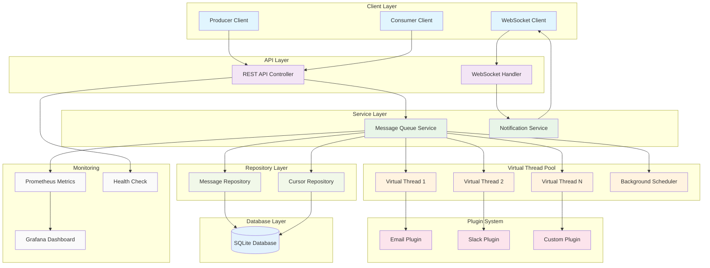
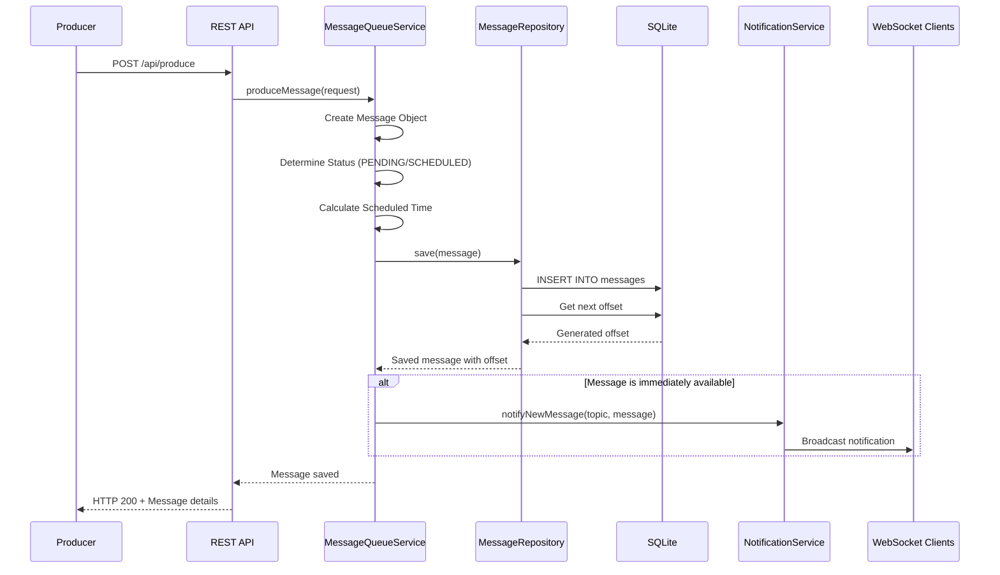
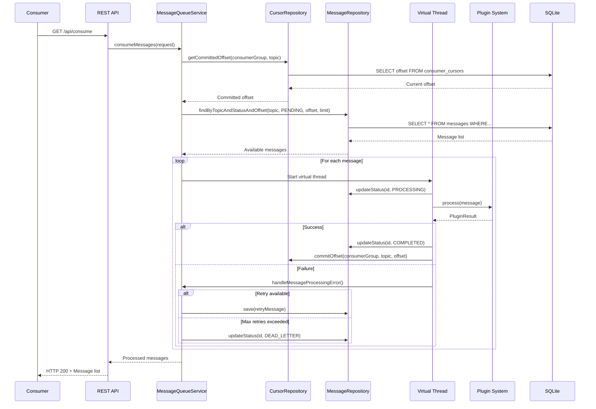
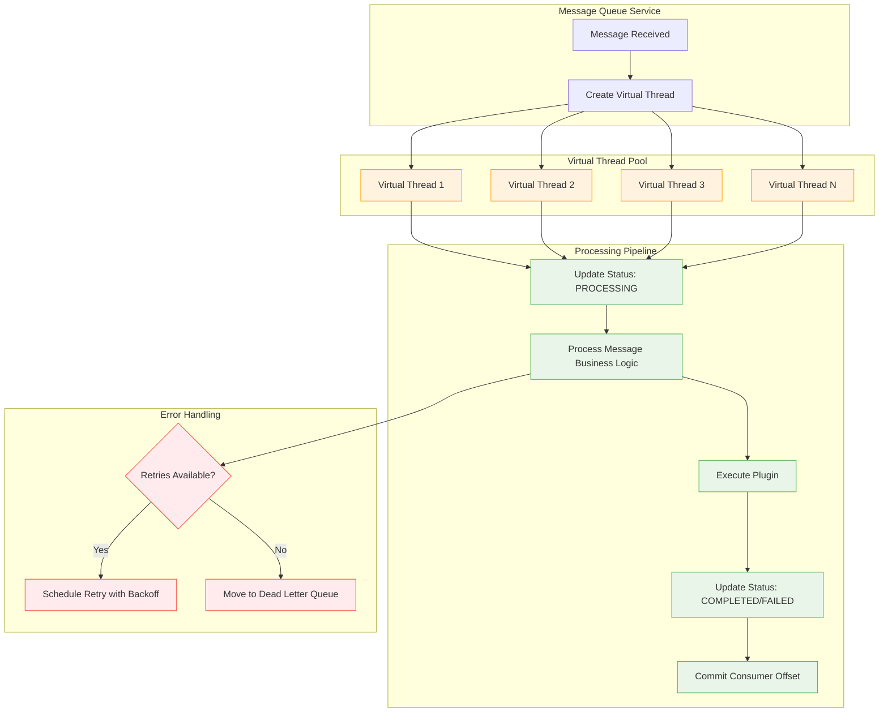
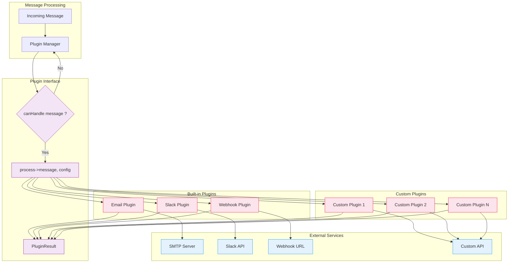
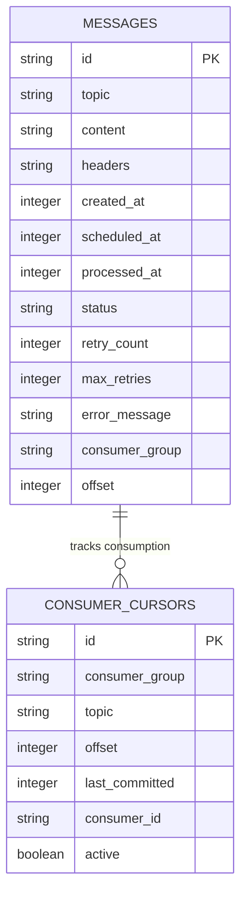
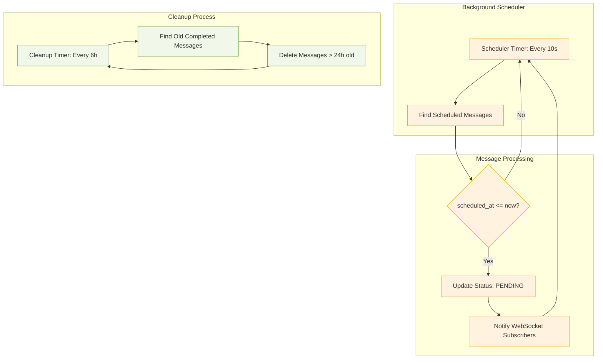
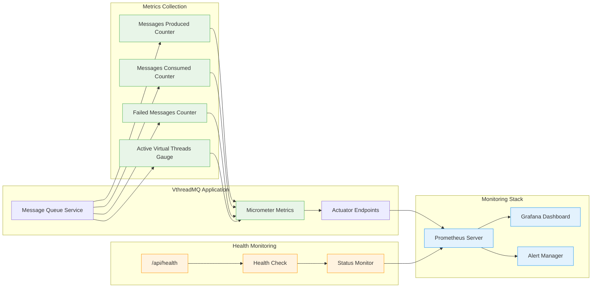
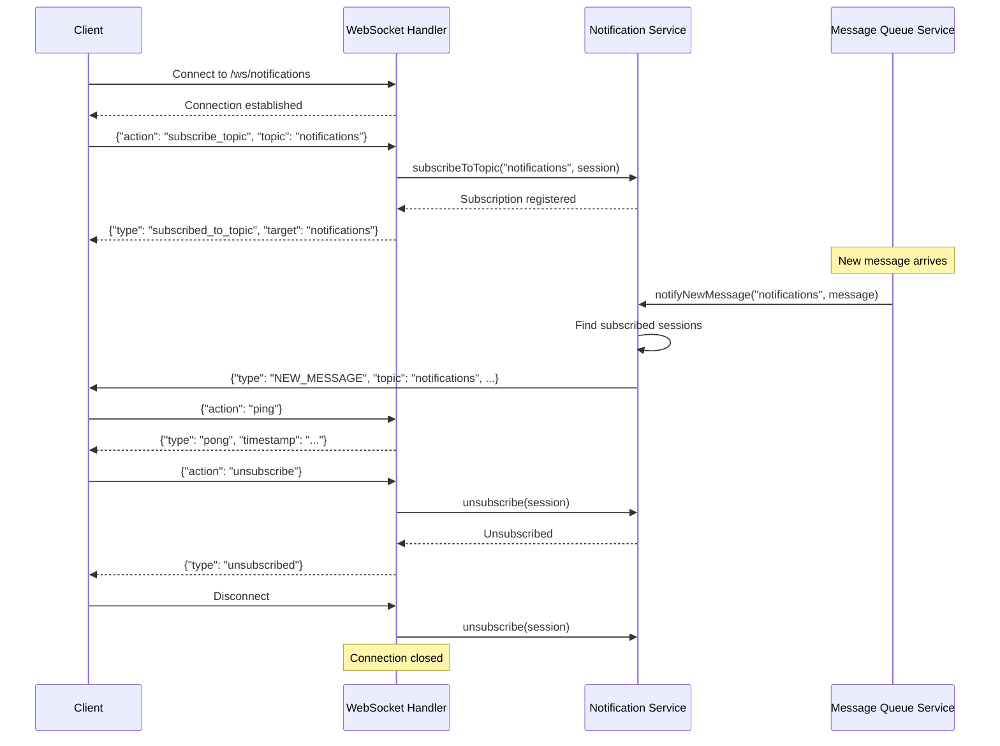

# VthreadMQ Architecture & Message Flow

This document provides visual representations of the VthreadMQ system architecture and message processing flow using Mermaid diagrams.

## 🏗️ Overall System Architecture

## 📨 Message Production Flow

## 🔄 Message Consumption Flow

## ⚡ Virtual Thread Processing

## 🔌 Plugin System Architecture

## 💾 Database Schema & Operations

## 🔄 Scheduled Message Processing

## 📊 Monitoring & Metrics Flow

## 🌐 WebSocket Real-time Notifications

---

## 🎯 Key Benefits Illustrated

### Virtual Threads Advantage
- **Traditional Threads**: Limited by OS thread count (~thousands)
- **Virtual Threads**: Can handle millions of concurrent operations
- **Memory Efficient**: Each virtual thread uses ~few KB vs ~1MB for OS threads
- **Simplified Code**: No need for complex async/await patterns

### Message Delivery Guarantees
- **At-least-once delivery**: Messages processed until successful or moved to dead letter queue
- **Offset-based tracking**: Reliable cursor management with persistent offsets
- **Automatic retry**: Configurable retry logic with exponential backoff
- **Dead letter queue**: Failed messages preserved for analysis

### Scalability Features
- **Auto-scaling**: Virtual thread pool grows/shrinks based on workload
- **Horizontal ready**: Designed for future cluster mode support
- **Efficient storage**: SQLite with proper indexing and cleanup
- **Plugin architecture**: Extensible without core system changes

This architecture provides a robust, scalable, and maintainable message queue system leveraging the latest Java 21 virtual threads technology. 